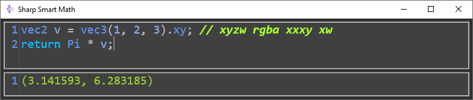
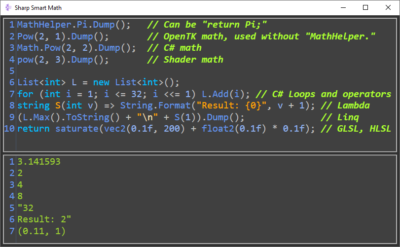
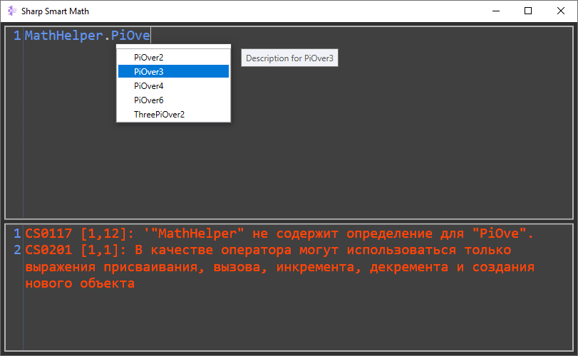

# SharpSmartMath
SharpSmartMath - Roslyn based realtime math (include shader math) and C# code compiler. Just write some code like:

"2 + 2" or "vec2((float)Math.Pow(2, 5) * sqrt(0.3)) * 5".

## Usage:
Compile from sources or download latest [release](../../releases). Change template "BaseProgram.cs" at output folder if needed.

#### Default Usage:

#### Functional:

#### Localized error and simple IntelliSense support:

## Links
SharpSmartMath: https://github.com/ALEXGREENALEX/SharpSmartMath

Used libs:
* AvalonEdit: https://github.com/icsharpcode/AvalonEdit
* OpenToolkitMath: https://github.com/opentk/opentk
* Roslyn: https://github.com/dotnet/roslyn

## Requirements
SharpSmartMath (WPF based GUI): .NET Framework 4.6.2
SharpSmartMathLib (Math and dynamic compilation Library): .NET Standart 2.0

## License:
**MIT**

## Author
Zelenskyi Alexandr
